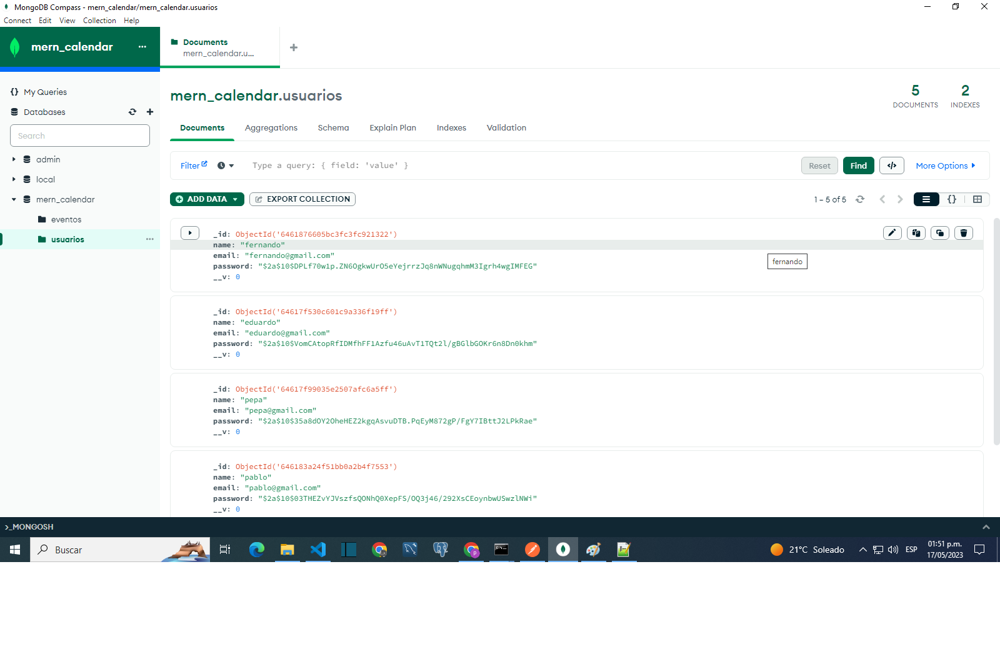

#Back end- Calendar

The intention of this project is to become familiar with the use of technologies such as nodejs, mongoDB and express, a course by Fernando Herrera was followed, 

Basically this backend can do the login and user registration with jwt and a crud of events

Mongo Atlas was used as the database engine.

Mongo Compass was used to manage the database.

All endpoints were tested with postman

frontend repository: https://github.com/theinsideshine/react-calendar-mern